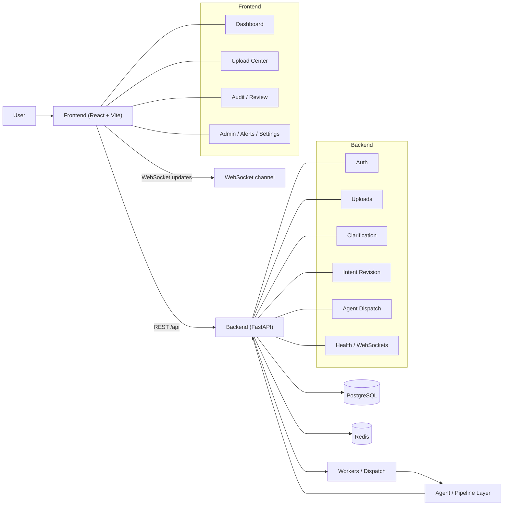
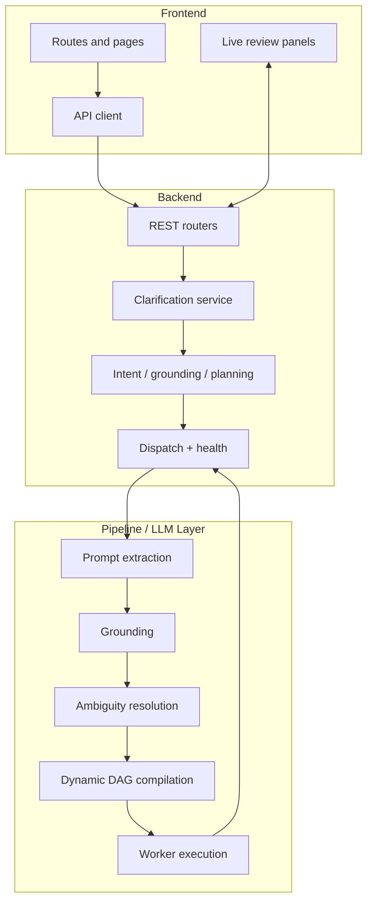
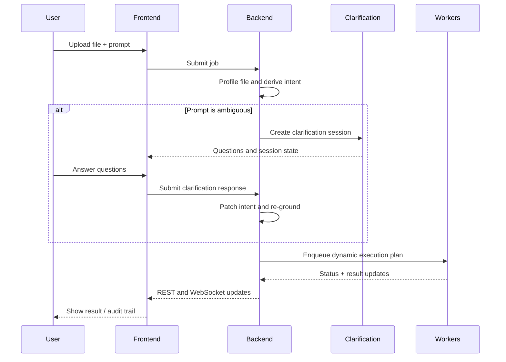

# FinFlow Analytics

FinFlow Analytics turns messy spreadsheet requests into structured workflows.

It is built for teams that need to upload XLSX files, describe work in plain English, and get back a deterministic, reviewable result without manually mapping every column or step.

## What It Solves

- Removes the need to build one-off scripts for every spreadsheet request.
- Handles inconsistent XLSX layouts without forcing users to rename everything first.
- Interprets natural-language prompts instead of relying on rigid forms.
- Detects ambiguity and asks follow-up questions instead of guessing.
- Converts the final request into an execution plan that can be audited and replayed.

## Key Features

- Natural-language workflow requests
- Spreadsheet-aware column grounding
- Interactive ambiguity resolution
- Dynamic DAG / execution-plan generation
- Live job progress and audit trail
- Backend worker dispatch for long-running tasks

## Project Layers

- `frontend/` - React app for users, managers, and admins.
- `backend/` - FastAPI API, persistence, auth, uploads, review, clarification, and dispatch.
- pipeline / LLM layer - semantic extraction, grounding, clarification, and execution-plan generation.

## Architecture Overview



## Component View



## Request Sequence



## End-to-End Flow

1. A user uploads a spreadsheet and writes a natural-language instruction.
2. The frontend sends the file and instruction to the backend.
3. The backend stores the submission, builds a data profile, and derives a canonical intent.
4. If the instruction is clear enough, the backend dispatches the job to the pipeline.
5. If the instruction is ambiguous, the backend creates a clarification session and returns structured questions to the frontend.
6. When the intent is resolved, the compiler turns it into a dynamic execution plan.
7. Workers execute the plan and push status updates back to the backend.
8. The frontend shows live state, review panels, and downloadable output.

## What The Pipeline Does

The pipeline converts a user instruction into something executable and auditable.

At a high level it does this:

- extract intent from the prompt
- normalize the request into a canonical schema
- ground column references against the uploaded dataset
- detect ambiguity and either clarify or fail closed
- compile the resolved intent into an execution plan
- dispatch the plan to worker agents
- collect results and surface them in the UI

The core idea is that the LLM does not directly "run the job". It helps interpret the request. The backend then turns that interpretation into deterministic structured work.

## Handling Varied XLSX Files

This project is designed around spreadsheet uploads, especially messy or inconsistent Excel files.

It handles variation by:

- reading the uploaded file into a structured data profile
- detecting column names, types, samples, and metadata
- grounding user terms like "salary", "amount", or "department" against the actual sheet columns
- using canonical intent and execution planning so the same user request can run against different spreadsheet layouts

This does not mean the system accepts every possible file type. The current application is spreadsheet-centered, but it is built to work across many XLSX shapes and naming conventions.

## Prompt Understanding

The prompt understanding layer is semantic, not just regex-based.

It treats the user instruction as a structured request and tries to infer:

- what action the user wants
- which columns are being referenced
- what output format is needed
- whether the request is a filter, transform, calculate, report, or visualization task

Relevant code paths:

- [backend/app/services/canonical_intent.py](backend/app/services/canonical_intent.py)
- [backend/app/services/semantic_pipeline.py](backend/app/services/semantic_pipeline.py)
- [backend/app/services/semantic_grounding.py](backend/app/services/semantic_grounding.py)

## Grounding

Grounding is the step where abstract user terms are matched to real dataset columns.

Example:

- user says `payment status`
- sheet contains `transaction_status`
- grounding resolves the request to the actual column if the match is strong enough

Grounding uses several layers:

- exact match
- case-insensitive match
- normalized match
- semantic/synonym-based match
- fuzzy fallback

If the system cannot confidently map a term, it does not invent a column. It marks the reference unresolved and routes the issue into clarification.

## Ambiguity Resolution

When a prompt is ambiguous, the system does not guess silently.

Instead it:

- creates a clarification session
- extracts unresolved fields
- generates targeted questions
- stores round history
- waits for the user response
- patches the intent
- re-checks grounding and coverage

Relevant code paths:

- [backend/app/services/clarification_service.py](backend/app/services/clarification_service.py)
- [backend/app/services/clarification_questions.py](backend/app/services/clarification_questions.py)
- [backend/app/models/clarification.py](backend/app/models/clarification.py)

This is the right place to think about prompts like:

- "filter by status"
- "show the top values"
- "group by department"

Those are only actionable once the system knows exactly which column or interpretation the user meant.

## Dynamic DAG / Execution Plan

The execution layer is dynamic because the graph is built from the resolved intent, not from a fixed hard-coded workflow.

The compiler decides the plan shape based on the request:

- ingestion always comes first
- cleaning is added only when needed
- filtering may insert a safe prep branch
- calculation is inserted when required
- visualization branches only appear when visualization is requested and enabled
- reporting is always the final output step

Relevant code paths:

- [backend/app/services/agent_dispatcher.py](backend/app/services/agent_dispatcher.py)
- [agent-framework/src/finflow_agent/planning/compiler.py](agent-framework/src/finflow_agent/planning/compiler.py)

In practice, the compiler creates `PlanStep` nodes with explicit `depends_on` and `input_from` links. That makes the DAG deterministic for a given intent, but still dynamic across different requests.

Visualization is also branched dynamically:

- one chart can create a single visualization branch
- multiple charts can create indexed branches like `df_calc_viz_1`, `df_visualized_1`, etc.

## Frontend And Backend Interaction

The frontend is responsible for presentation and user interaction.

It shows:

- upload forms
- dashboard and job status
- audit trail and job detail
- clarification panels
- admin and alerts views

The backend is responsible for:

- authentication and authorization
- file upload and persistence
- semantic intent derivation
- clarification state machine
- dispatching work to workers
- returning job detail and review data
- broadcasting live updates

The interaction pattern is:

- frontend sends requests over REST
- backend returns job state, intent state, and review state
- WebSocket updates are used for live clarification and execution events
- polling is used in some screens for fresh job state

## Data Stores And Infrastructure

- PostgreSQL stores submissions, intents, clarifications, audit logs, users, and job state.
- Redis is used for background queueing and dispatch coordination.
- Workers execute long-running processing out of band.

## Main Directories

- `frontend/` - React UI, routing, page views, and shared styling.
- `backend/` - FastAPI app, services, routers, schemas, and persistence.
- `agent-framework/` - pipeline and agent implementation details plus architecture tests.
- `database/` - database-related assets.
- `docs/` - supporting documentation.

## Important Files

- [frontend/src/main.jsx](frontend/src/main.jsx) - app bootstrap and route table.
- [frontend/src/shell/AppShell.jsx](frontend/src/shell/AppShell.jsx) - shared shell and navigation.
- [frontend/src/pages/AuditPage.jsx](frontend/src/pages/AuditPage.jsx) - job detail and review view.
- [backend/app/main.py](backend/app/main.py) - FastAPI entrypoint.
- [backend/app/api/](backend/app/api) - API routers.
- [backend/app/services/](backend/app/services) - business logic and pipeline helpers.

## Run Locally

Frontend:

```bash
cd frontend
npm install
npm run dev
```

Backend:

```bash
cd backend
python -m uvicorn app.main:app --reload
```

Agent framework (installable package):

```bash
pip install -e ./agent-framework
```

This makes `finflow_agent` importable without any `sys.path` manipulation, e.g. `from finflow_agent.engine import ExecutionEngine`.

## Notes

- The old employee chatbot feature has been removed from the active app.
- Historical Alembic migrations are preserved as schema history.
- The dynamic execution plan is deterministic for a given resolved intent.

## Extending The Pipeline

If you want to add a new agent, action type, or planning branch, keep the changes aligned across the whole stack:

1. Define the intent shape in the semantic and canonical models.
2. Update grounding so user terms resolve to real columns or structured values.
3. Add clarification rules if the new action can be ambiguous.
4. Extend the compiler so the new branch becomes part of the execution DAG.
5. Teach the backend dispatcher how to serialize and enqueue the new work.
6. Add frontend support only if the user needs a new review or configuration surface.
7. Add tests for both the happy path and the ambiguity / unsupported cases.

Useful places to start:

- [backend/app/services/canonical_intent.py](backend/app/services/canonical_intent.py)
- [backend/app/services/semantic_pipeline.py](backend/app/services/semantic_pipeline.py)
- [backend/app/services/clarification_service.py](backend/app/services/clarification_service.py)
- [backend/app/services/agent_dispatcher.py](backend/app/services/agent_dispatcher.py)
- [agent-framework/src/finflow_agent/planning/compiler.py](agent-framework/src/finflow_agent/planning/compiler.py)
